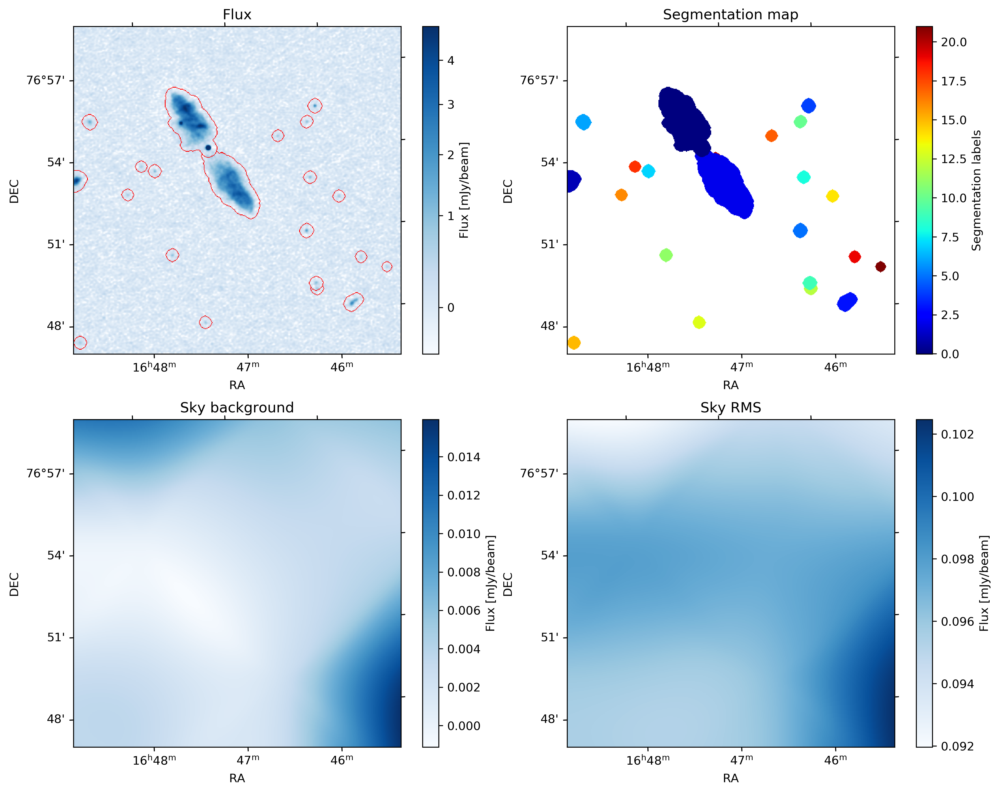
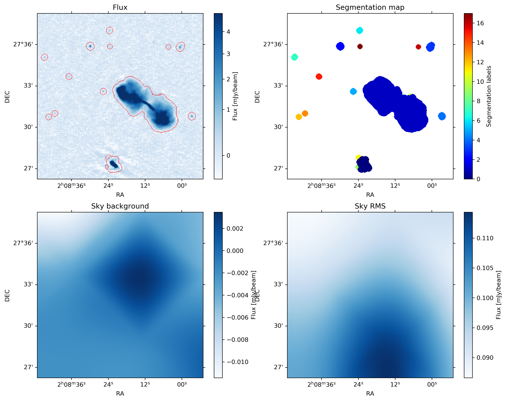
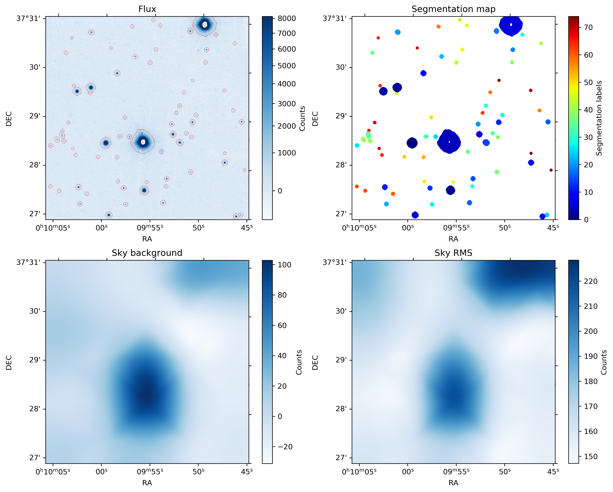
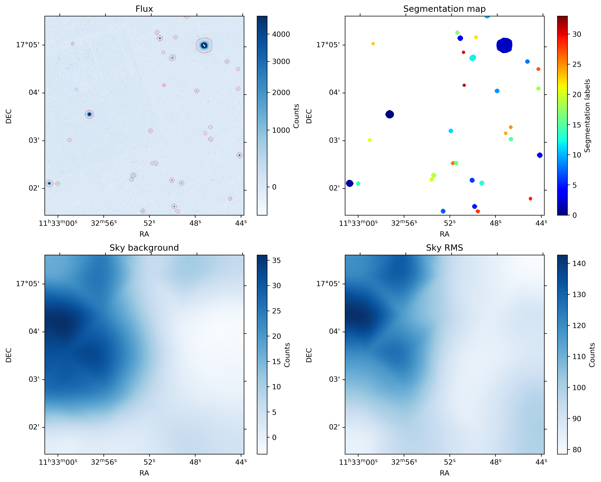

# PyFound
A fast Python implementation of the ProFound source extraction algorithm by Robotham et al. (2018).

Based on:
> A.S.G. Robotham, L.J.M. Davies, S.P. Driver, S. Koushan, D.S. Taranu, S. Casura, J. Liske *ProFound: Source Extraction and Application to Modern Survey Data*, MNRAS preprint (February 2018)

### Word of caution

The implementation of ProFound in this package is not exact: some liberties were taken with respect to the original implementation presented by Robotham et al. (2018), either to improve upon their work or due to incompleteness of the description of the algorithm in the original paper. Therefore, **one should not see this package as an exact copy of the original algorithm**. However, The performance is largely the same.

### Performance

This code makes extensive use of the [Numba](https://numba.pydata.org/) Just In Time (JIT) compiler that translates a subset of Python and NumPy code into fast machine code. When the code is run for the first time, all the JIT functions need to be compiled, thus increasing the overall runtime. After the first run, the code should be much quicker due to most of the compiled functions being cached.

The complete runtime for a 480 by 480 pixel LoTSS image (see below) for the cached code is ~1.5 s on a single core of an Intel Xeon E5507 @ 2.27 GHz with 280 MB of RAM used. For a 1000 by 1000 pixel PanSTARRS i-band image (see below) the extraction takes 6 to 10 s, depending on the number of sources.

### Dependencies

PyFound requires the following packages to be installed:
- `NumPy`
- `Numba`
- `scipy`
- `skimage`

### Attribution

If you have made use of this code in your research, please attribute the original paper by Robotham et al. (2018) and this Python implementation project.

### Examples

##### LoTSS (LOFAR Two Meter Sky Survey)

These are images in the radio at a frequency of 150 MHz. The resolution is 6"/beam.

##### PanSTARRS

Optical images of 1000 by 1000 pixels in i and r band, respectively.

